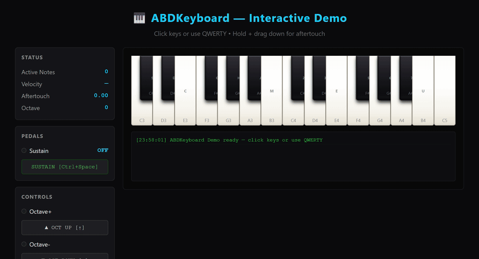

# ABDKeyboard

Best-of-breed virtual piano keybed, pitch/mod wheels, octave controls, QWERTY support, and LED animations — shared across all ABDSynths projects.

Assembled from the strongest features of **ABDMS2000**, **ABDEep**, and **ABDCZ101**.

## Features

| Feature | Source | Description |
|---|---|---|
| Responsive key count (2–5 octaves) | ABDMS2000 | Key count adapts to container width |
| Velocity curves (soft/hard/linear/fixed) | ABDEep | Per-key velocity by Y-position with configurable curve |
| Pressure display (AT+MW+PB) | ABDEep | Visual aftertouch + modwheel + pitchbend glow on keys |
| Pitch-bend displacement | ABDEep | Keys shift horizontally during pitch bend |
| LED color by mode | ABDEep | Different LED color for arp/seq/chord states |
| Per-key ivory texture | ABDEep | Deterministic HSL variations per key |
| Vintage wear stains | ABDCZ101 | Per-key yellowing, scuffs, dings for aged look |
| QWERTY keyboard | ABDCZ101 | Full 2-row mapping (Ableton/JUCE standard) |
| Arrow key octave shift | ABDCZ101 | ArrowUp/Down shifts octave |
| Wheel filmstrip (101 frames) | ABDMS2000 | Sprite-based pitch/mod wheels with spring return |
| Touch support | ABDMS2000 | Multi-touch on mobile/tablet |
| LED sweep animation | All | Cascade glow across keys on patch/bank change |
| Panic flash | All | Triple strobe on All Notes Off |
| Auto-generated panic button | All | Styled button to right of keybed with red LED + tooltip |
| Panic keyboard shortcut | All | Ctrl+Q / Cmd+Q triggers All Notes Off |
| Sustain pedal (CC#64) | All | Toggle button + Ctrl+Space, onSustainChange callback |
| Aftertouch (channel + polyphonic) | ABDEep | Configurable pressure generation from pointer or software API |
| Velocity callback | ABDEep | onVelocityChange fires on every note-on with velocity value |

## Layout Diagram

```
┌─────────────────────────────────────────────────────────────────────────────┐
│                        ABDKeyboard — Visual Layout                          │
├─────────────────────────────────────────────────────────────────────────────┤
│                                                                             │
│  ┌─────────┐  ┌─────────┐        ┌──────────────────────────────────────┐  │
│  │ PITCH   │  │ MOD     │        │           OCTAVE CONTROLS            │  │
│  │ WHEEL   │  │ WHEEL   │        │                                      │  │
│  │         │  │         │        │   [LED]        OCT+        [LED]     │  │
│  │  ▲  │   │  │  ▲  │   │        │                                      │  │
│  │  │  │   │  │  │  │   │        │   [LED]        OCT-        [LED]     │  │
│  │  ▼  │   │  │  ▼  │   │        │                                      │  │
│  │         │  │         │        └──────────────────────────────────────┘  │
│  │ ±2 semitones │ 0-127 │                                                   │
│  │ spring return │       │                                                   │
│  └─────────┘  └─────────┘                                                   │
│                                                                             │
│  ┌──────────────────────────────────────────────────────────────────────┐  │
│  │                        PIANO KEYBED                                  │  │
│  │                                                                      │  │
│  │   C   D   E   F   G   A   B   C   D   E   F   G   A   B   C        │  │
│  │  ┌─┐ ┌─┐ ┌─┐ ┌─┐ ┌─┐ ┌─┐ ┌─┐ ┌─┐ ┌─┐ ┌─┐ ┌─┐ ┌─┐ ┌─┐ ┌─┐ ┌─┐    │  │
│  │  │█│ │█│ │ │ │█│ │█│ │█│ │ │ │█│ │█│ │ │ │█│ │█│ │█│ │ │ │█│ │    │  │
│  │  │█│ │█│ │ │ │█│ │█│ │█│ │ │ │█│ │█│ │ │ │█│ │█│ │█│ │ │ │█│ │    │  │
│  │  └─┘ └─┘ └─┘ └─┘ └─┘ └─┘ └─┘ └─┘ └─┘ └─┘ └─┘ └─┘ └─┘ └─┘ └─┘    │  │
│  │  ╧   ╧   ╧   ╧   ╧   ╧   ╧   ╧   ╧   ╧   ╧   ╧   ╧   ╧   ╧      │  │
│  │  white keys (ivory texture)  +  black keys (raised)                 │  │
│  │                                                                      │  │
│  │  ┌────────────────────────────────────────────────────────────────┐ │  │
│  │  │  QWERTY: Z S X D C V G B H N J M , L . ; /                    │ │  │
│  │  │  QWERTY: Q 2 W 3 E R 5 T 6 Y 7 U I 9 O 0 P [ = ]             │ │  │
│  │  └────────────────────────────────────────────────────────────────┘ │  │
│  │                                                                      │  │
│  │  ┌────────────────────────────────────────────────────────────────┐ │  │
│  │  │                        PANIC + SUSTAIN                         │ │  │
│  │  │                                                                │ │  │
│  │  │   ┌──────────┐   ┌──────────┐                                  │ │  │
│  │  │   │ 🔴 LED   │   │ 🟢 LED   │                                  │ │  │
│  │  │   │  ALL     │   │  SUST    │                                  │ │  │
│  │  │   │  OFF     │   │          │                                  │ │  │
│  │  │   │          │   │          │                                  │ │  │
│  │  │   │ [Ctrl+Q] │   │[Ctrl+SP] │                                  │ │  │
│  │  │   └──────────┘   └──────────┘                                  │ │  │
│  │  │   Panic Button    Sustain Button                                │ │  │
│  │  └────────────────────────────────────────────────────────────────┘ │  │
│  └──────────────────────────────────────────────────────────────────────┘  │
│                                                                             │
├─────────────────────────────────────────────────────────────────────────────┤
│  INTERACTION MODEL                                                          │
│                                                                             │
│  🔹 Velocity:     Y-position on key → velocity (0..1)                      │
│                   Fixed mode: constant velocity (default: 0.85)            │
│                   Curves: soft (quadratic), hard (sqrt), linear, normal    │
│                                                                             │
│  🔹 Aftertouch:   Pointer Y-movement on held key → pressure (0..1)         │
│                   Channel: note=-1 (shared across all notes)               │
│                   Polyphonic: note=N (per-note pressure)                   │
│                                                                             │
│  🔹 Sustain:      Toggle on/off → onSustainChange callback                 │
│                   Visual: green LED on sustain button                      │
│                   MIDI: CC#64 emulation                                    │
│                                                                             │
│  🔹 Panic:        Release all notes + flash LEDs                           │
│                   Visual: red strobe on all keys + panic button LED        │
│                   MIDI: All Notes Off + Active Sensing                     │
│                                                                             │
│  🔹 Pitch Bend:   Wheel → -2..+2 semitones (spring return)                 │
│                   Optional: keys shift horizontally when bending            │
│                                                                             │
│  🔹 Mod Wheel:    Wheel → 0..127 (CC#1)                                    │
│                   Visual: blue glow on pressured keys                      │
│                                                                             │
├─────────────────────────────────────────────────────────────────────────────┤
│  CSS THEME TOKENS                                                           │
│                                                                             │
│  --kbd-bg              Background color (#080808)                           │
│  --kbd-white-top       White key top gradient (#fdfcf8)                    │
│  --kbd-black-top       Black key top gradient (#2f2f35)                    │
│  --kbd-led-color       LED glow color when key active (#00ccff)           │
│  --kbd-sweep-color     Sweep animation color (#00ccff)                     │
│  --kbd-panic-color     Panic flash color (#ff2233)                         │
│  --kbd-font            Monospace font for labels (Share Tech Mono)         │
│  --kbd-ivory-base      Ivory texture base color (per-key HSL)             │
└─────────────────────────────────────────────────────────────────────────────┘
```

## Installation

### As npm workspace (recommended)

```bash
# From your synth project root
npm install @abdsynths/keyboard --workspace-root
```

```js
// In your synth's package.json
{
  "dependencies": {
    "@abdsynths/keyboard": "0.1.0"
  }
}
```

### As git submodule

```bash
git submodule add ../ABDKeyboard Shared/ABDKeyboard
```

```html
<!-- In your index.html -->
<link rel="stylesheet" href="Shared/ABDKeyboard/src/keyboard.css">
<script type="module">
  import { createKeyboard } from './Shared/ABDKeyboard/src/keyboard.js';
</script>
```

### Copy (simplest)

```bash
cp -r ../ABDKeyboard/src/ ./src/components/keyboard/
```

## Demo

<div align="center">
  
  <br>
  <em>⬆ Live demo: QWERTY notes → velocity control → aftertouch → sustain pedal → panic flash</em>
</div>

Interactive demo page showing all features — open `demo/index.html` in a browser:

```bash
# macOS
open demo/index.html

# Windows
start demo/index.html

# Linux
xdg-open demo/index.html
```

### GIF sequence breakdown

| Frame | Feature demonstrated |
|---|---|
| 1–2 | Idle keyboard → C major chord (QWERTY: Q+E+T) |
| 3–7 | Melody: single notes C D E F G with velocity |
| 8–10 | Velocity control: top (soft) → bottom (loud) → middle |
| 11 | Aftertouch: click + drag down on C4 |
| 12 | Sustain pedal: notes held after key release |
| 13 | Chromatic scale: Z-M row full hold |
| 14–15 | Panic: Ctrl+Q red LED flash → all notes off |
| 16 | Clean idle state |

See [`demo/README.md`](demo/README.md) for full GIF recording instructions and alternative tools.

### Regenerating the GIF

```bash
# 1. Capture frames with headless Chrome
node demo/capture.mjs

# 2. Assemble into animated GIF with ffmpeg
ffmpeg -framerate 6 -i demo/frames/frame-%03d.png \
  -vf "scale=960:-1:flags=lanczos,split[s0][s1];[s0]palettegen[p];[s1][p]paletteuse" \
  -loop 0 demo/keyboard-demo.gif

# Output: demo/keyboard-demo.gif (~224KB, 16 frames, 6fps, loops forever)
```

## Usage

```js
import { createKeyboard } from '@abdsynths/keyboard';
// or: import { createKeyboard } from './components/keyboard/keyboard.js';

const kbd = createKeyboard({
  // DOM IDs
  containerId: 'piano-keyboard',
  wheelPitchId: 'pitch-wheel-container',
  wheelModId: 'mod-wheel-container',
  octUpId: 'oct-up',
  octDownId: 'oct-down',
  ledUpId: 'led-up',
  ledDownId: 'led-down',

  // Callbacks (bridge-agnostic)
  onNoteOn: (note, vel) => bridge.noteOn(note, vel),
  onNoteOff: (note) => bridge.noteOff(note),
  onPitchBend: (val) => bridge.pitchBend(val),
  onModWheel: (val) => bridge.modWheel(val),
  onPanic: () => bridge.allNotesOff(),
  onSustainChange: (on) => on ? bridge.sustainOn() : bridge.sustainOff(),
  onAftertouch: (note, pressure) => {
    if (note === -1) bridge.channelPressure(pressure);   // channel AT
    else bridge.polyPressure(note, pressure);            // polyphonic AT
  },
  onVelocityChange: (note, vel) => bridge.velocityUpdate(note, vel),
  panicBtnId: null,     // omit to auto-generate panic button
  sustainBtnId: null,   // omit to auto-generate sustain button

  // Config
  config: {
    numOctaves: 4,
    startNote: 36,
    maxOctaveShift: 3,
    velocitySource: 'fixed',       // 'fixed' | 'yPosition'
    velocityCurve: 'normal',       // 'normal' | 'soft' | 'hard' | 'linear' | 'fixed'
    enableQwerty: true,
    enableTouch: true,
    enablePressureDisplay: false,  // ABDEep feature
    enablePitchBendDisplace: false,
    enableIvoryTexture: false,
    enableVintageWear: false,
    enableAftertouch: false,       // generate aftertouch from pointer movement
    aftertouchMode: 'channel',     // 'channel' | 'polyphonic'
    aftertouchSensitivity: 0.5,   // 0..1 — how much Y-movement maps to pressure
    getLedColor: null,             // () => '#ff3366' for dynamic color
    getPressureState: null,        // () => { aftertouch, modWheel, pitchBend }
  },
});

// ── Velocity control ──
kbd.setLedColor('#ff3366');

// ── Sustain pedal (CC#64 emulation) ──
kbd.setSustain(true);     // activate sustain
kbd.setSustain(false);    // release sustain
kbd.toggleSustain();      // toggle
kbd.getSustain();         // true | false

// ── Aftertouch (CC#132 / polyphonic) ──
kbd.setAftertouch(-1, 0.8);    // channel aftertouch (note=-1)
kbd.setAftertouch(60, 0.5);    // polyphonic aftertouch for note 60
kbd.releaseAftertouch(-1);      // release channel aftertouch
kbd.releaseAftertouch(60);      // release polyphonic aftertouch
kbd.getAftertouch();            // current channel pressure (0..1)
});

// Panic: click the auto-generated button to the right of the keys,
// or press Ctrl+Q / Cmd+Q, or call:
kbd.panic();                    // All Notes Off + flash LED
kbd.sweep('right', 8);         // Cascade LED animation
kbd.getOctave();                // -3..+3
kbd.setOctave(2);
kbd.highlightNote(60, 0.8);    // Light key without noteOn
kbd.releaseNote(60);
kbd.setLedColor('#ff3366');
kbd.setOctaveCount(5, 24);     // Re-render with 5 octaves starting at C1
kbd.getActiveNotes();           // [60, 64, 67]
kbd.destroy();                  // Full cleanup
```

## Quick-Reference Card

```
╔═════════════════════════════════════════════════════════════════════════════╗
║                     ABDKeyboard — Quick Reference Card                      ║
╚═════════════════════════════════════════════════════════════════════════════╝

┌─────────────────────────────────────────────────────────────────────────────┐
│  PUBLIC API METHODS                                                         │
├─────────────────────────────────────────────────────────────────────────────┤
│                                                                             │
│  NOTE CONTROL                                                               │
│  ──────────────────────────────────────────────────────────────────────────  │
│  kbd.panic()                        Release all notes + flash LEDs          │
│  kbd.highlightNote(midi, vel?)       Light key without noteOn               │
│  kbd.releaseNote(midi)               Release specific note                 │
│  kbd.getActiveNotes()                Get currently held notes [midi, ...]  │
│                                                                             │
│  OCTAVE CONTROL                                                             │
│  ──────────────────────────────────────────────────────────────────────────  │
│  kbd.getOctave()                     Current shift: -3..+3                 │
│  kbd.setOctave(n)                    Set octave shift                       │
│  kbd.setOctaveCount(n, start?)       Re-render with N octaves               │
│                                                                             │
│  SUSTAIN (CC#64)                                                             │
│  ──────────────────────────────────────────────────────────────────────────  │
│  kbd.setSustain(on)                  Activate/deactivate sustain            │
│  kbd.getSustain()                    Current state: true | false            │
│  kbd.toggleSustain()                 Toggle sustain on/off                  │
│                                                                             │
│  AFTERTOUCH                                                                  │
│  ──────────────────────────────────────────────────────────────────────────  │
│  kbd.setAftertouch(note, pressure)   note=-1 for channel, N for poly       │
│  kbd.releaseAftertouch(note)         Release aftertouch (pressure=0)       │
│  kbd.getAftertouch()                 Channel pressure: 0..1                │
│                                                                             │
│  VISUAL                                                                      │
│  ──────────────────────────────────────────────────────────────────────────  │
│  kbd.sweep(dir?, speed?)             LED animation ('right'|'left', ms)    │
│  kbd.setLedColor(hex)                Override LED color globally            │
│  kbd.destroy()                       Full cleanup + DOM reset               │
│                                                                             │
└─────────────────────────────────────────────────────────────────────────────┘

┌─────────────────────────────────────────────────────────────────────────────┐
│  KEYBOARD SHORTCUTS                                                         │
├─────────────────────────────────────────────────────────────────────────────┤
│                                                                             │
│  Ctrl+Q / Cmd+Q            Panic — All Notes Off + flash                   │
│  Ctrl+Space / Cmd+Space    Toggle Sustain Pedal (CC#64)                    │
│  Arrow Up                  Shift octave up                                 │
│  Arrow Down                Shift octave down                               │
│                                                                             │
│  QWERTY NOTES (when enableQwerty: true)                                    │
│  ──────────────────────────────────────────────────────────────────────────  │
│  Lower row:  Z  S  X  D  C  V  G  B  H  N  J  M  ,  L  .  ;  /           │
│              C3 D3 E3 F3 G3 A3 B3 C4 D4 E4 F4 G4 A4 B4 C5 D5 E5          │
│                                                                             │
│  Upper row:  Q  2  W  3  E  R  5  T  6  Y  7  U  I  9  O  0  P  [  =  ]   │
│              C4 D4 E4 F4 G4 A4 B4 C5 D5 E5 F5 G5 A5 B5 C6 D6 E6 F6 G6 A6 B6│
│                                                                             │
│  Note: Ctrl+Q and Ctrl+Space work ALWAYS (even with enableQwerty: false)   │
│                                                                             │
└─────────────────────────────────────────────────────────────────────────────┘

┌─────────────────────────────────────────────────────────────────────────────┐
│  CALLBACKS (inject into createKeyboard)                                     │
├─────────────────────────────────────────────────────────────────────────────┤
│                                                                             │
│  onNoteOn(note, velocity)          Fired on key press                      │
│                                    note: MIDI 0..127, velocity: 0..1       │
│                                                                             │
│  onNoteOff(note)                   Fired on key release                    │
│                                    note: MIDI 0..127                       │
│                                                                             │
│  onPitchBend(value)                Pitch wheel moved                       │
│                                    value: -1.0..+1.0 (±2 semitones)       │
│                                                                             │
│  onModWheel(value)                 Mod wheel moved                         │
│                                    value: 0..1 (MIDI 0..127)              │
│                                                                             │
│  onPanic()                         All Notes Off triggered                 │
│                                                                             │
│  onSustainChange(on)               Sustain toggled                         │
│                                    on: true (sustain on) | false (off)    │
│                                                                             │
│  onAftertouch(note, pressure)      Aftertouch changed                      │
│                                    note: -1 (channel) or N (polyphonic)   │
│                                    pressure: 0..1                          │
│                                                                             │
│  onVelocityChange(note, velocity)  Velocity calculated for a note          │
│                                    note: MIDI 0..127, velocity: 0..1       │
│                                                                             │
└─────────────────────────────────────────────────────────────────────────────┘

┌─────────────────────────────────────────────────────────────────────────────┐
│  CONFIG OPTIONS                                                             │
├─────────────────────────────────────────────────────────────────────────────┤
│                                                                             │
│  BASIC                                                                       │
│  ──────────────────────────────────────────────────────────────────────────  │
│  numOctaves           4      Number of octaves (2–5)                       │
│  startNote            36     Starting MIDI note (C2)                       │
│  maxOctaveShift       3      Max octave shift range                        │
│                                                                             │
│  VELOCITY                                                                 │
│  ──────────────────────────────────────────────────────────────────────────  │
│  velocitySource       'fixed'   'fixed' | 'yPosition'                     │
│  velocityCurve        'normal'  'normal'|'soft'|'hard'|'linear'|'fixed'   │
│  fixedVelocity        0.85     Constant velocity when source='fixed'      │
│                                                                             │
│  AFTERTOUCH                                                                │
│  ──────────────────────────────────────────────────────────────────────────  │
│  enableAftertouch     false    Generate from pointer Y movement            │
│  aftertouchMode       'channel'  'channel' | 'polyphonic'                 │
│  aftertouchSensitivity 0.5     Pointer-to-pressure mapping (0..1)         │
│                                                                             │
│  VISUAL FEATURES                                                            │
│  ──────────────────────────────────────────────────────────────────────────  │
│  enablePressureDisplay false   Show pressure glow on keys                  │
│  enablePitchBendDisplace false  Keys shift on pitch bend                  │
│  enableIvoryTexture   false    Per-key ivory texture (white keys)          │
│  enableVintageWear    false    Per-key aging stains                        │
│                                                                             │
│  INPUT                                                                       │
│  ──────────────────────────────────────────────────────────────────────────  │
│  enableQwerty         true     QWERTY keyboard input                       │
│  enableTouch          true     Touch support (mobile/tablet)               │
│                                                                             │
│  EXTERNAL SOURCES                                                            │
│  ──────────────────────────────────────────────────────────────────────────  │
│  getLedColor          null     () => '#ff3366'  Dynamic LED color         │
│  getPressureState     null     () => { aftertouch, modWheel, pitchBend }  │
│                                                                             │
└─────────────────────────────────────────────────────────────────────────────┘

┌─────────────────────────────────────────────────────────────────────────────┐
│  MAPPING: ABDKeyboard → MIDI                                                │
├─────────────────────────────────────────────────────────────────────────────┤
│                                                                             │
│  EVENT               MIDI MESSAGE              NOTES                       │
│  ──────────────────────────────────────────────────────────────────────────  │
│  Key press           Note On (0x90)            note, velocity               │
│  Key release         Note Off (0x80)           note                         │
│  Sustain on          CC#64 (0xB0) value>0      —                           │
│  Sustain off         CC#64 (0xB0) value=0      —                           │
│  Channel AT          Aftertouch (0xD0)         pressure (0..127)           │
│  Polyphonic AT       Poly AT (0xA0)            note, pressure              │
│  Pitch bend          Pitch Bend (0xE0)         -1.0..+1.0                 │
│  Mod wheel           CC#1 (0xB0)               0..1                       │
│  Panic               All Notes Off (0x7B)      —                           │
│                      All Sound Off (0x78)      —                           │
│                                                                             │
└─────────────────────────────────────────────────────────────────────────────┘
```

## Keyboard Shortcuts

| Shortcut | Action | Scope |
|---|---|---|
| **Ctrl+Q / Cmd+Q** | **Panic — All Notes Off + flash** | Always active |
| **Ctrl+Space / Cmd+Space** | **Toggle Sustain Pedal (CC#64)** | Always active |
| Arrow Up | Shift octave up | Always active |
| Arrow Down | Shift octave down | Always active |
| Z–M (lower row) | Play notes C3–G4 | QWERTY enabled |
| Q–] (upper row) | Play notes C4–D5 | QWERTY enabled |

> **Note:** Ctrl+Q and Ctrl+Space work even when `enableQwerty: false`. The QWERTY note keys require `enableQwerty: true` (default).

## Project-Specific Configuration

### ABDMS2000

```js
createKeyboard({
  config: { numOctaves: 4, velocitySource: 'fixed' },
  onNoteOn: (n, v) => bridge.noteOn(n, v),
  onSustainChange: (on) => bridge.sustain(on),
});
```

### ABDEep (full experience)

```js
createKeyboard({
  config: {
    velocitySource: 'yPosition',
    velocityCurve: 'normal',
    enablePressureDisplay: true,
    enablePitchBendDisplace: true,
    enableIvoryTexture: true,
    enableAftertouch: true,
    aftertouchMode: 'polyphonic',
    aftertouchSensitivity: 0.6,
  },
  getLedColor: () => arpActive ? '#ff3366' : seqActive ? '#9933ff' : 'var(--color-accent)',
  getPressureState: () => ({ aftertouch: at, modWheel: mw, pitchBend: pb }),
  onAftertouch: (note, pressure) => {
    if (note === -1) synth.setChannelPressure(pressure * 127);
    else synth.setPolyPressure(note, pressure * 127);
  },
  onVelocityChange: (note, vel) => synth.updateVelocity(note, vel),
  onSustainChange: (on) => synth.setSustain(on),
});
```

### ABDCZ101 (vintage feel)

```js
createKeyboard({
  config: {
    numOctaves: 4,
    startNote: 36,
    enableVintageWear: true,
    enableQwerty: true,
  },
  wheelPitchId: null,  // CZ-101 has no wheels
  wheelModId: null,
});
```

## CSS Theme Tokens

All colors and fonts are customizable via CSS custom properties:

```css
.kbd-piano-keys { --kbd-bg: #080808; }
.kbd-white-key  { --kbd-white-top: #fdfcf8; --kbd-white-base: #ffffff; }
.kbd-black-key  { --kbd-black-top: #2f2f35; }
.active::before { --kbd-led-color: #00ccff; }
```

## Testing

```bash
cd ABDKeyboard
npm install
npm test  # 88 tests, vitest + jsdom
```

## License

Proprietary — UNLICENSED (internal ABDSynths use only).
