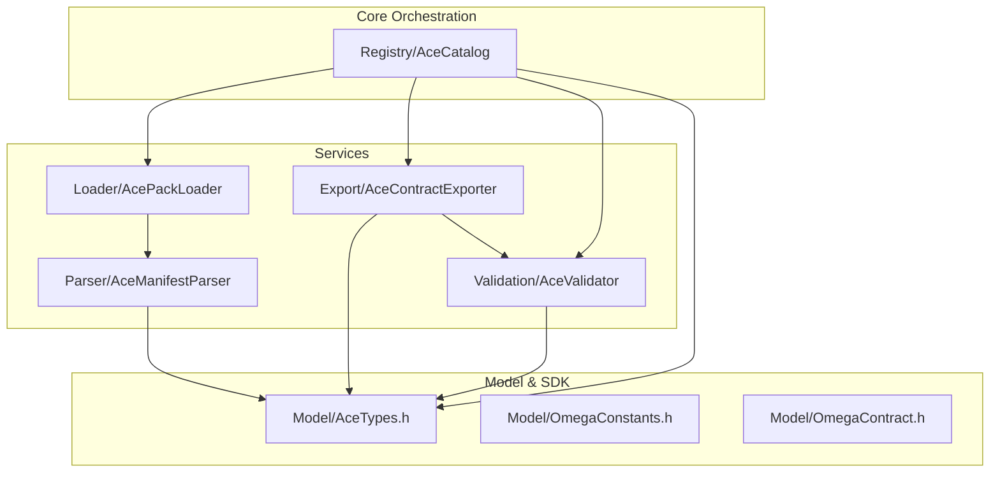

# ACE Core Architecture Map

This directory contains the core logic for the **OMEGA Aseptic Component Engine (ACE)**. It is organized into functional sub-modules to ensure industrial scalability.

## Directory Structure

| Module | Purpose |
| :--- | :--- |
| **[Model/](file:///d:/desarrollos/ABDOmega/src/Core/Ace/Model/)** | Technical definitions, constants, and the module developer SDK. |
| **[Registry/](file:///d:/desarrollos/ABDOmega/src/Core/Ace/Registry/)** | Central orchestration and component inventory management. |
| **[Parser/](file:///d:/desarrollos/ABDOmega/src/Core/Ace/Parser/)** | Manifest decoding (YAML/JSON) and WASM introspection. |
| **[Loader/](file:///d:/desarrollos/ABDOmega/src/Core/Ace/Loader/)** | Ingestion from the filesystem and compressed `.acepack` files. |
| **[Export/](file:///d:/desarrollos/ABDOmega/src/Core/Ace/Export/)** | Generation of technical contracts and schemas for the WebUI. |
| **[Validation/](file:///d:/desarrollos/ABDOmega/src/Core/Ace/Validation/)** | Enforces Era 7 architectural standards and spatial integrity. |

## File Map

| File | Module | Description |
| :--- | :--- | :--- |
| [AceTypes.h](file:///d:/desarrollos/ABDOmega/src/Core/Ace/Model/AceTypes.h) | Model | Centralized data structures for components and UI. |
| [OmegaContract.h](file:///d:/desarrollos/ABDOmega/src/Core/Ace/Model/OmegaContract.h) | Model | SDK for WASM module self-description. |
| [OmegaConstants.h](file:///d:/desarrollos/ABDOmega/src/Core/Ace/Model/OmegaConstants.h) | Model | Shared technical identifiers. |
| [AceCatalog.h](file:///d:/desarrollos/ABDOmega/src/Core/Ace/Registry/AceCatalog.h) | Registry | The main catalog entry point. |
| [AceManifestParser.h](file:///d:/desarrollos/ABDOmega/src/Core/Ace/Parser/AceManifestParser.h) | Parser | YAML/JSON manifest decoding logic. |
| [AcePackLoader.h](file:///d:/desarrollos/ABDOmega/src/Core/Ace/Loader/AcePackLoader.h) | Loader | Filesystem and ZIP ingestion service. |
| [AceContractExporter.h](file:///d:/desarrollos/ABDOmega/src/Core/Ace/Export/AceContractExporter.h) | Export | Contract generation for the WebUI. |
| [AceValidator.h](file:///d:/desarrollos/ABDOmega/src/Core/Ace/Validation/AceValidator.h) | Validation | Compliance guard and spatial integrity auditor. |

## Architectural Relationships

## Maintenance

When adding new functionality to the ACE engine, ensure it is placed in the appropriate functional sub-folder. Avoid bloating the `Registry/` folder with parsing or I/O logic.
