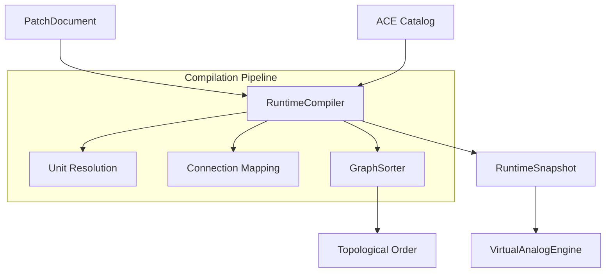

# OMEGA Core: Compiler Subsystem Map

## Overview
The **Compiler** subsystem is responsible for transforming the declarative user intent (**PatchDocument**) into a high-performance execution plan (**RuntimeSnapshot**) for the DSP engine. It enforces Era 7.2.3 industrial standards, including topological sorting for zero-latency feedback-free execution.

## Directory Structure

### [Orchestration/](file:///d:/desarrollos/ABDOmega/src/Core/Compiler/Orchestration/)
*   **[RuntimeCompiler.h](file:///d:/desarrollos/ABDOmega/src/Core/Compiler/Orchestration/RuntimeCompiler.h)**: Main entry point for the compilation pipeline.
*   **[RuntimeCompiler.cpp](file:///d:/desarrollos/ABDOmega/src/Core/Compiler/Orchestration/RuntimeCompiler.cpp)**: Coordinates unit resolution, connection mapping, and global state initialization.

### [Graph/](file:///d:/desarrollos/ABDOmega/src/Core/Compiler/Graph/)
*   **[GraphSorter.h](file:///d:/desarrollos/ABDOmega/src/Core/Compiler/Graph/GraphSorter.h)**: Interface for graph analysis utilities.
*   **[GraphSorter.cpp](file:///d:/desarrollos/ABDOmega/src/Core/Compiler/Graph/GraphSorter.cpp)**: Implementation of Kahn's Algorithm for topological ordering.

## Component Relationships

## Key Responsibilities
1.  **Unit Resolution**: Mapping abstract module types to concrete implementation IDs via the ACE Catalog.
2.  **Connection Routing**: Building the audio and modulation routing tables for the modular voice.
3.  **Topological Sorting**: Ensuring that modules are executed in an order that respects signal dependencies, preventing unwanted unit delays.
4.  **Aseptic Validation**: Ensuring the resulting snapshot complies with Era 7 spatial and safety boundaries.
