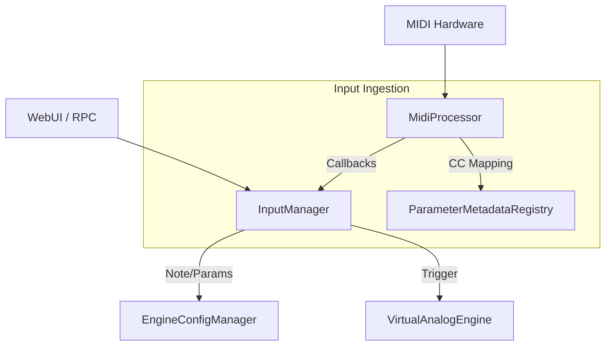

# OMEGA Core: Input Subsystem Map

## Overview
The **Input** subsystem manages all external control data entering the OMEGA ecosystem. It unifies MIDI processing, CC mapping, and RPC-driven triggers into a centralized ingestion pipeline.

## Directory Structure

### [Midi/](file:///d:/desarrollos/ABDOmega/src/Core/Input/Midi/)
*   **[MidiProcessor.h](file:///d:/desarrollos/ABDOmega/src/Core/Input/Midi/MidiProcessor.h)**: Core engine for MIDI ingestion and mapping.
*   **[MidiProcessor.cpp](file:///d:/desarrollos/ABDOmega/src/Core/Input/Midi/MidiProcessor.cpp)**: Implements message handling, note routing, and CC-to-Parameter resolution via `ParameterMetadataRegistry`.

### [Manager/](file:///d:/desarrollos/ABDOmega/src/Core/Input/Manager/)
*   **[InputManager.h](file:///d:/desarrollos/ABDOmega/src/Core/Input/Manager/InputManager.h)**: Orchestrator that unifies multiple input streams (MIDI, RPC, HID).

## Component Relationships

## Key Responsibilities
1.  **MIDI Ingestion**: High-performance processing of `juce::MidiBuffer` in the audio thread.
2.  **Semantic Mapping**: Translating raw CC numbers into stable internal Parameter IDs.
3.  **Note Orchestration**: Routing note-on/off events from both hardware and the virtual keyboard.
4.  **Aseptic Filtering**: Enforcing global MIDI channels and sanitizing malformed messages.

## Legacy Status
*   `MidiMonitor.h` has been deprecated and moved to `/legacy/` as its functionality is now superseded by the industrial `MidiProcessor` and standard telemetry hubs.
