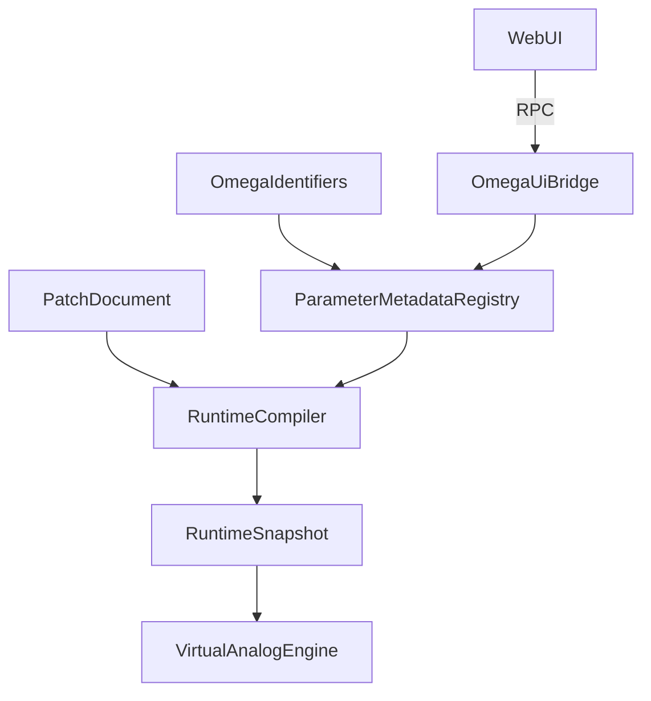

# OMEGA Core: Model Subsystem Map

## Overview
The **Model** subsystem defines the high-level data contracts and semantic primitives of the OMEGA platform. It encapsulates the "Source of Truth" (PatchDocument), the "DSP Reality" (RuntimeSnapshot), and the centralized metadata registry for parameters and identifiers.

## Directory Structure

### [Identifiers/](file:///d:/desarrollos/ABDOmega/src/Core/Model/Identifiers/)
*   **[OmegaIdentifiers.h](file:///d:/desarrollos/ABDOmega/src/Core/Model/Identifiers/OmegaIdentifiers.h)**: Global semantic identifiers (JUCE based).

### [Parameters/](file:///d:/desarrollos/ABDOmega/src/Core/Model/Parameters/)
*   **[ParameterTypes.h](file:///d:/desarrollos/ABDOmega/src/Core/Model/Parameters/ParameterTypes.h)**: Primitive types, enums, and ModSource definitions.
*   **[ParameterDescriptor.h](file:///d:/desarrollos/ABDOmega/src/Core/Model/Parameters/ParameterDescriptor.h)**: Technical contract for a single parameter.
*   **[ParameterMetadataRegistry.h](file:///d:/desarrollos/ABDOmega/src/Core/Model/Parameters/ParameterMetadataRegistry.h)**: Central registry for parameter metadata and MIDI CC mapping.

### [Patch/](file:///d:/desarrollos/ABDOmega/src/Core/Model/Patch/)
*   **[PatchDocument.h](file:///d:/desarrollos/ABDOmega/src/Core/Model/Patch/PatchDocument.h)**: The declarative state of a synth patch (Era 7).
*   **[PatchIdentifiers.h](file:///d:/desarrollos/ABDOmega/src/Core/Model/Patch/PatchIdentifiers.h)**: Specific IDs for patch nodes and connections.

### [Runtime/](file:///d:/desarrollos/ABDOmega/src/Core/Model/Runtime/)
*   **[RuntimeSnapshot.h](file:///d:/desarrollos/ABDOmega/src/Core/Model/Runtime/RuntimeSnapshot.h)**: The compiled, performance-optimized state for the audio engine.

## Component Relationships

## Key Responsibilities
1.  **Semantic Governance**: Ensuring that `cutoff` means the same thing in the UI, the Manifest, and the DSP engine.
2.  **State Declaration**: Defining the structure of a modular patch (Era 7).
3.  **Metadata Orchestration**: Managing technical attributes (range, unit, CC) for every controllable parameter.
4.  **Runtime Optimization**: Providing a lean, pointer-free snapshot for the real-time audio thread.
