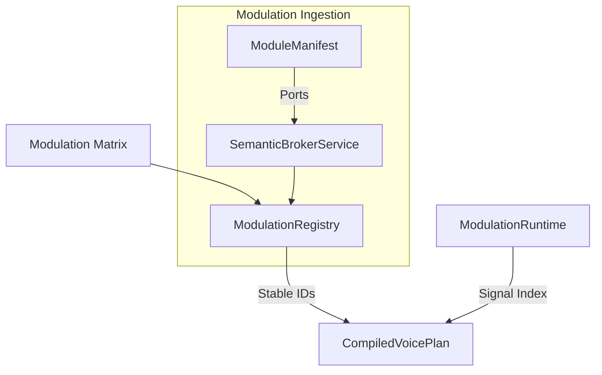

# OMEGA Core: Modulation Subsystem Map

## Overview
The **Modulation** subsystem defines the routing, signaling, and manifestation contracts for the modular synthesis engine. It provides the semantic bridge between hardware MIDI/LFO sources and the internal DSP signal space.

## Directory Structure

### [Types/](file:///d:/desarrollos/ABDOmega/src/Core/Modulation/Types/)
*   **[ModulationTypes.h](file:///d:/desarrollos/ABDOmega/src/Core/Modulation/Types/ModulationTypes.h)**: Primitive node types and IDs for the modulation graph.
*   **[SignalTypes.h](file:///d:/desarrollos/ABDOmega/src/Core/Modulation/Types/SignalTypes.h)**: Definitions for Audio, CV, Gate, and Phase signals.
*   **[ModPortTypes.h](file:///d:/desarrollos/ABDOmega/src/Core/Modulation/Types/ModPortTypes.h)**: Descriptor types for module inputs and outputs.

### [Manifest/](file:///d:/desarrollos/ABDOmega/src/Core/Modulation/Manifest/)
*   **[ModuleManifest.h](file:///d:/desarrollos/ABDOmega/src/Core/Modulation/Manifest/ModuleManifest.h)**: The structural "social contract" of a module instance.

### [Registry/](file:///d:/desarrollos/ABDOmega/src/Core/Modulation/Registry/)
*   **[ModulationRegistry.h](file:///d:/desarrollos/ABDOmega/src/Core/Modulation/Registry/ModulationRegistry.h)**: Service interface for mapping semantic IDs to stable DSP indices.
*   **[ModulationRegistry.cpp](file:///d:/desarrollos/ABDOmega/src/Core/Modulation/Registry/ModulationRegistry.cpp)**: Implementation of stable ID resolution and static source discovery.

### [Metadata/](file:///d:/desarrollos/ABDOmega/src/Core/Modulation/Metadata/)
*   **[ModulationDescriptors.h](file:///d:/desarrollos/ABDOmega/src/Core/Modulation/Metadata/ModulationDescriptors.h)**: High-level descriptors for sources and targets.

## Component Relationships

## Key Responsibilities
1.  **Signal Governance**: Defining how audio, CV, and triggers interact within the modular environment.
2.  **Port Manifestation**: Advertising module capabilities to the engine and UI via a standardized contract.
3.  **Stable Mapping**: Ensuring that modulation routes persist correctly across binary versions of the engine.
4.  **Semantic Resolution**: Translating user-friendly names (e.g. "VCF Cutoff") into technical execution slots.
