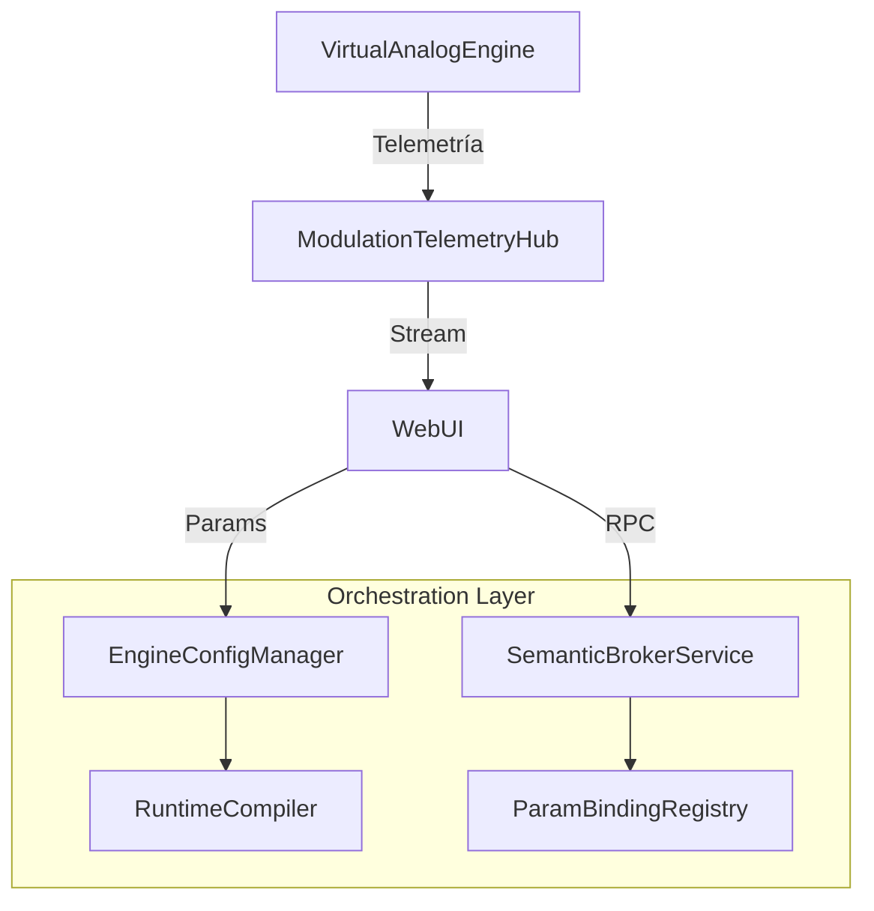

# OMEGA Core: Providers Subsystem Map

## Overview
The **Providers** subsystem acts as the orchestration layer for the OMEGA platform. it manages the bridge between high-level user intent, semantic signal mapping, real-time configuration updates, and high-performance telemetry monitoring.

## Directory Structure

### [Telemetry/](file:///d:/desarrollos/ABDOmega/src/Core/Providers/Telemetry/)
*   **[ModulationTelemetryHub.h](file:///d:/desarrollos/ABDOmega/src/Core/Providers/Telemetry/ModulationTelemetryHub.h)**: Lock-free real-time signal buffer for UI visualization.
*   **[ModulationTelemetryRegistry.h](file:///d:/desarrollos/ABDOmega/src/Core/Providers/Telemetry/ModulationTelemetryRegistry.h)**: Registry for mapping DSP pins to telemetry slots.

### [Semantic/](file:///d:/desarrollos/ABDOmega/src/Core/Providers/Semantic/)
*   **[SemanticBrokerService.h](file:///d:/desarrollos/ABDOmega/src/Core/Providers/Semantic/SemanticBrokerService.h)**: High-level discovery of module capabilities and manifest inventory.
*   **[ParamBindingRegistry.h](file:///d:/desarrollos/ABDOmega/src/Core/Providers/Semantic/ParamBindingRegistry.h)**: Mapping between stable parameter IDs and Engine Config actions.

### [Routing/](file:///d:/desarrollos/ABDOmega/src/Core/Providers/Routing/)
*   **[PatchbayMatrixService.h](file:///d:/desarrollos/ABDOmega/src/Core/Providers/Routing/PatchbayMatrixService.h)**: Logic for compiling the modulation matrix into the execution plan.

## Component Relationships

## Key Responsibilities
1.  **State Management**: Maintaining the "Golden Patch" and ensuring atomic updates to the audio thread.
2.  **Telemetry Flow**: Enabling real-time visualization of internal DSP signals with zero impact on audio performance.
3.  **Semantic Brokerage**: Bridging the gap between declarative manifests and the technical requirements of the synthesis engine.
4.  **Global Governance**: Managing system-level settings, voice counts, and persistence.
