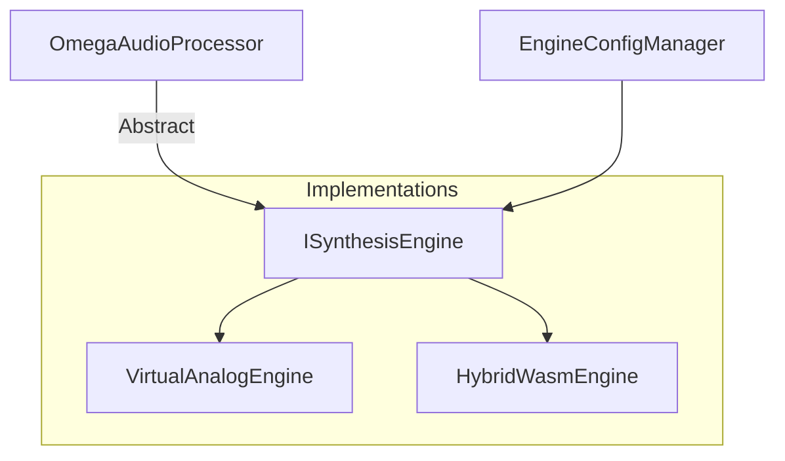

# OMEGA Core: Service Subsystem Map

## Overview
The **Service** subsystem defines the abstract contracts and master interfaces that govern the behavior of high-level engine components. It serves as the architectural glue, ensuring that different implementations (e.g., Virtual Analog, Wavetable, WASM-based) adhere to the same technical standards.

## Directory Structure

### [Engine/](file:///d:/desarrollos/ABDOmega/src/Core/Service/Engine/)
*   **[ISynthesisEngine.h](file:///d:/desarrollos/ABDOmega/src/Core/Service/Engine/ISynthesisEngine.h)**: The master interface for audio generation engines.

### [Config/](file:///d:/desarrollos/ABDOmega/src/Core/Service/Config/)
*   **[EngineConfigManager.h](file:///d:/desarrollos/ABDOmega/src/Core/Service/Config/EngineConfigManager.h)**: Orchestrator for engine state and atomic snapshot rotation.
*   **[SystemSettingsManager.h](file:///d:/desarrollos/ABDOmega/src/Core/Service/Config/SystemSettingsManager.h)**: Global application settings (Preferences, Voice allocation).

## Component Relationships

## Key Responsibilities
1.  **Interface Standardization**: Defining the lifecycle and real-time requirements for audio engines.
2.  **Polymorphic Execution**: Enabling the host to swap between different synthesis technologies without breaking the signal chain.
3.  **Thread Safety Contracts**: Enforcing the separation between non-real-time preparation and real-time rendering.
