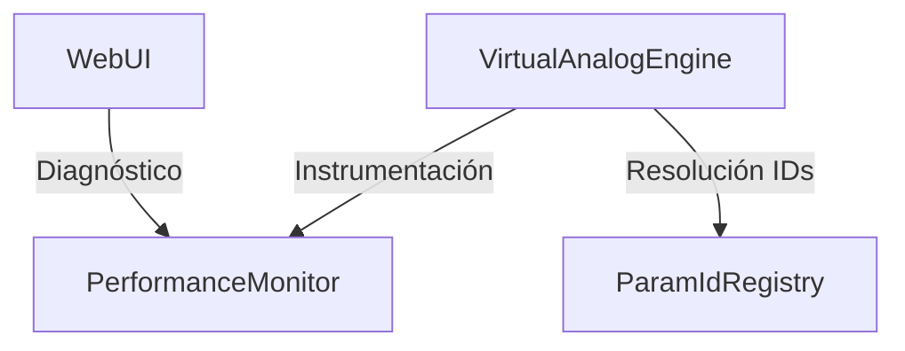

# OMEGA Core: Util Subsystem Map

## Overview
The **Util** subsystem provides cross-cutting technical utilities and diagnostic tools for the OMEGA platform. It focuses on performance instrumentation, identifier registry, and low-level data structures.

## Directory Structure

### [Performance/](file:///d:/desarrollos/ABDOmega/src/Core/Util/Performance/)
*   **[PerformanceMonitor.h](file:///d:/desarrollos/ABDOmega/src/Core/Util/Performance/PerformanceMonitor.h)**: Atomic performance counter for the audio thread.

### [Registry/](file:///d:/desarrollos/ABDOmega/src/Core/Util/Registry/)
*   **[ParamIdRegistry.h](file:///d:/desarrollos/ABDOmega/src/Core/Util/Registry/ParamIdRegistry.h)**: Bi-directional mapping between semantic strings and stable numeric IDs.

## Component Relationships

## Key Responsibilities
1.  **Identifier Stability**: Ensuring that parameter IDs remain constant during runtime for lock-free resolution.
2.  **Performance Visibility**: Measuring execution times in the audio thread without introducing locks or latency.
3.  **Cross-Cutting Concerns**: Providing shared utilities that are used across all layers of the engine.
