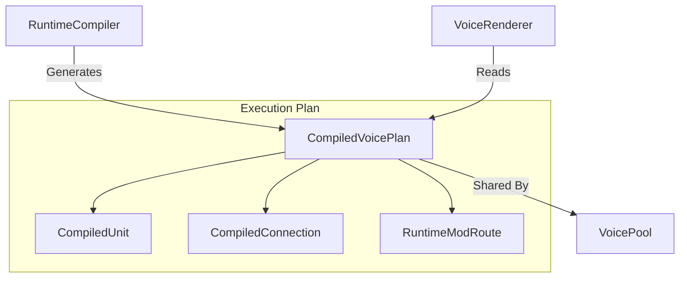

# OMEGA Core: Voice Subsystem Map

## Overview
The **Voice** subsystem defines the execution plans and signal structures for individual synthesis voices. It acts as the technical bridge between the declarative PatchDocument and the low-level DSP renderers, optimizing the synthesis graph for real-time performance.

## Directory Structure

### [Plan/](file:///d:/desarrollos/ABDOmega/src/Core/Voice/Plan/)
*   **[CompiledVoicePlan.h](file:///d:/desarrollos/ABDOmega/src/Core/Voice/Plan/CompiledVoicePlan.h)**: The immutable execution plan for a voice (Units, Connections, Routes).
*   **[CompiledSignalSpace.h](file:///d:/desarrollos/ABDOmega/src/Core/Voice/Plan/CompiledSignalSpace.h)**: Centralized modulation signal address space.

## Component Relationships

## Key Responsibilities
1.  **Plan Compilation**: Transforming a complex node graph into a linear execution list of units and connections.
2.  **Signal Addressing**: Providing a stable numbering system for LFOs, Envelopes, and MIDI controllers.
3.  **Memory Optimization**: Structuring the voice plan for cache-efficient access during the audio callback.
4.  **Resource Sharing**: Enabling multiple voices to reference the same immutable plan, reducing memory overhead for high-polyphony patches.
