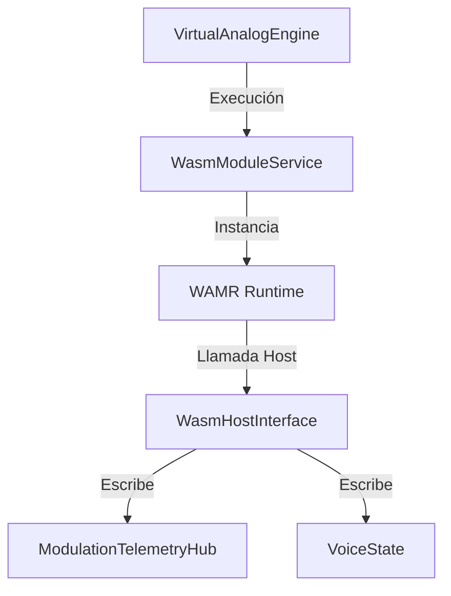

# OMEGA Core: WASM Subsystem Map

## Overview
The **Wasm** subsystem enables the integration of external, high-performance binary modules (primitives) into the OMEGA engine. It uses the WebAssembly Micro Runtime (WAMR) to execute sandboxed code with near-native performance, providing a secure and flexible plugin architecture.

## Directory Structure

### [Host/](file:///d:/desarrollos/ABDOmega/src/Core/Wasm/Host/)
*   **[WasmHostInterface.h/.cpp](file:///d:/desarrollos/ABDOmega/src/Core/Wasm/Host/WasmHostInterface.h)**: Defines the ABI (Application Binary Interface) for the engine, exposing host functions (imports) to WASM modules (e.g., audio buffers, telemetry, MIDI).

### [Service/](file:///d:/desarrollos/ABDOmega/src/Core/Wasm/Service/)
*   **[WasmModuleService.h/.cpp](file:///d:/desarrollos/ABDOmega/src/Core/Wasm/Service/WasmModuleService.h)**: Singleton orchestrator responsible for loading, instantiating, and executing WASM modules across multiple voices.

## Component Relationships

## Key Responsibilities
1.  **Module Sandboxing**: Executing untrusted or third-party DSP code in a secure environment with controlled memory access.
2.  **ABI Governance**: Providing a stable set of host imports for modules to interact with the engine's timing, audio, and MIDI systems.
3.  **Voice-Parallel Execution**: Managing multiple instances of the same WASM module to support polyphony (up to 32 voices).
4.  **Zero-Copy Audio**: Efficiently mapping host audio buffers into WASM memory space to minimize overhead during the process callback.
