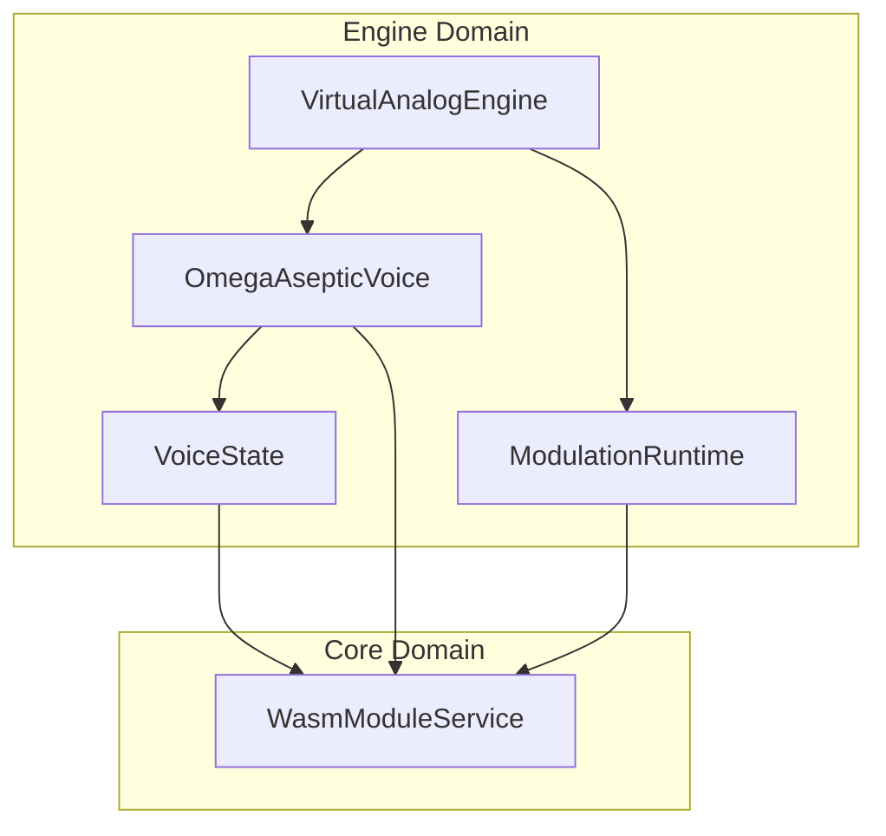

# OMEGA Engine Map (Era 7.2.3)

## 🏗️ Directory Structure

- **Modular/**: Orchestration layer for the synthesis engine.
  - `VirtualAnalogEngine.h/.cpp`: Main engine host that manages voices and global modulation.
  - `OmegaAsepticVoice.h`: Voice-level orchestrator for WASM module execution.
- **Modulation/**: Global modulation processing.
  - `ModulationRuntime.h/.cpp`: Optimized runtime for global LFOs and Envelopes (Aseptic WASM-based).
  - `MotionRecorder.h`: Automation and motion capture utility.
- **Voice/**: Low-level voice state management.
  - `VoiceState.h`: Shared state structure for voice buses, MIDI, and modulation signals.

## 🔗 Relationships (Mermaid)

## 📄 File Descriptions

| File | Description |
| :--- | :--- |
| `VirtualAnalogEngine.h` | Root orchestrator of the OMEGA synthesis environment. |
| `OmegaAsepticVoice.h` | Pure container that executes the WASM synthesis graph for a single note. |
| `ModulationRuntime.h` | Global signal hub for monophonic modulators (LFOs, etc). |
| `VoiceState.h` | The "Signal Board" of a voice, containing buses and MIDI state. |
| `MotionRecorder.h` | Captures and plays back parameter movements (Automation). |

---
*OMEGA — Engineering Standard V7.2.3 — Industrial Engine Mapping*
