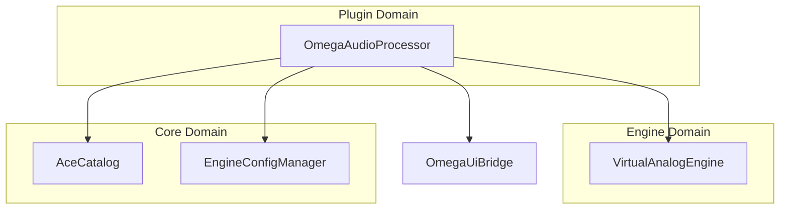

# OMEGA Plugin Map (Era 7.2.3)

## 🏗️ Directory Structure

- **Processor/** (Planned): Will contain the decoupled AudioProcessor logic.
- **Editor/** (Planned): Will contain the JUCE Editor wrapper.
- `OmegaAudioProcessor.h/.cpp`: The main JUCE bridge that connects the OMEGA Aseptic Engine with the host DAW.

## 🔗 Relationships (Mermaid)

## 📄 File Descriptions

| File | Description |
| :--- | :--- |
| `OmegaAudioProcessor.h` | JUCE AudioProcessor implementation. Acts as the high-level orchestrator for the entire plugin. |
| `CMakeLists.txt` | Build configuration for the OMEGA VST3/AU/Standalone plugin. |

---
*OMEGA — Engineering Standard V7.2.3 — Industrial Plugin Mapping*
