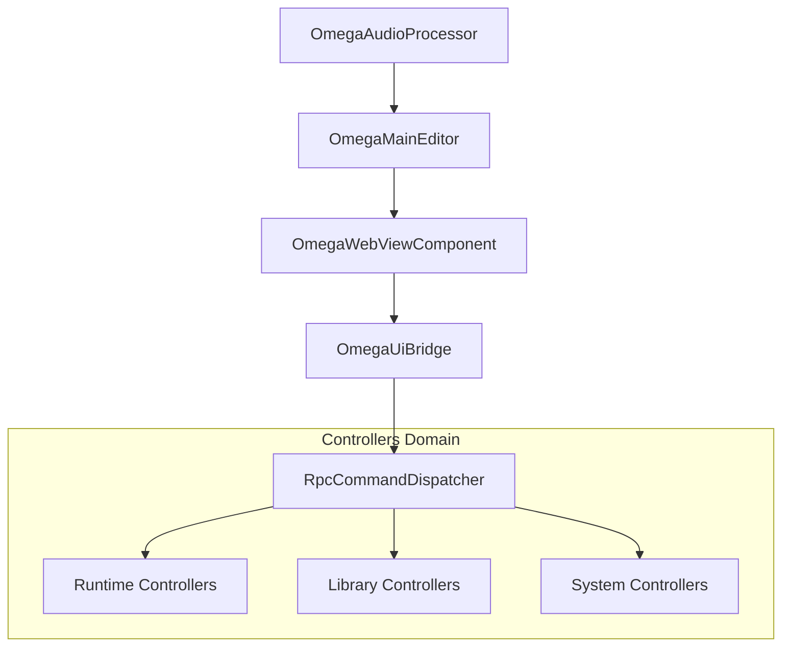

# OMEGA UI Map (Era 7.2.3)

## 🏗️ Directory Structure

- **Bridge/**: Orchestration layer between JUCE and the WebUI.
  - `OmegaUiBridge.h/.cpp`: The "Brain" of the UI communication.
- **Controllers/**: Specialized RPC handlers organized by domain.
  - **Base/**: Foundations of the RPC system.
    - `RpcBaseController.h`: Abstract base with response/error helpers.
    - `RpcCommandDispatcher.h`: Logic for routing JSON-RPC calls.
  - **Runtime/**: Real-time signal and parameter manipulation.
    - `RpcParameterController`: Bridge to DAW automation (APVTS).
    - `RpcModulationController`: Signal routing and patchbay logic.
    - `RpcTelemetryController`: High-speed streaming for Scopes and LEDs.
    - `RpcInputController`: MIDI and external audio monitoring.
  - **Library/**: Asset and inventory management.
    - `RpcPresetController`: Patch loading/saving and catalog sync.
    - `RpcMetadataController`: **Adaptive** inventory and host environment sync.
  - **System/**: Global configuration.
    - `RpcSystemController`: Persistent settings and preferences.
- **Editor/**: Native JUCE View components.
  - `OmegaMainEditor.h`: Root JUCE window.
  - `OmegaWebViewComponent.h`: WebView2 container with local asset resolution.

## 🔗 Relationships (Mermaid)

## 📄 Architectural Principles

| Domain | Principle |
| :--- | :--- |
| **Base** | Zero-dependency core logic for the RPC protocol. |
| **Runtime** | Lock-free interaction with the audio engine's snapshot. |
| **Library** | Single source of truth (SOT) via the AceCatalog. |
| **System** | Persistence and adaptive environment detection. |

---
*OMEGA — Engineering Standard V7.2.3 — Industrial UI Mapping*
